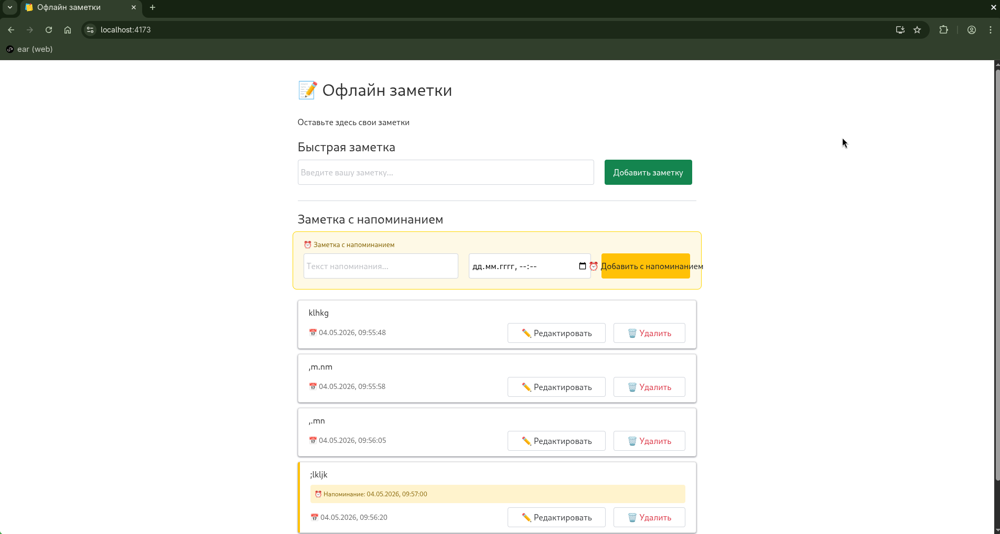

# 📝 Офлайн Заметки — PWA приложение

## Контрольная работа №3

**Дисциплина:** Фронтенд и бэкенд разработка  
**Семестр:** 4 семестр, 2025/2026 уч. год  
**Преподаватели:** Загородних Николай Анатольевич, Краснослободцева Дарья Борисовна, Бочаров Михаил Иванович

---

## Общее описание проекта

Прогрессивное веб-приложение (PWA) для управления заметками. Приложение позволяет создавать, редактировать, удалять заметки, а также устанавливать напоминания с push-уведомлениями.



**Ключевые возможности:**

| Функция | Описание |
|---------|----------|
| 📝 CRUD заметок | Создание, чтение, редактирование, удаление |
| 💾 Офлайн-режим | Работа без интернета (Service Worker) |
| 📱 Установка PWA | Добавление на домашний экран устройства |
| ⚡ App Shell | Мгновенная загрузка каркаса приложения |
| 🔒 HTTPS | Безопасное соединение (локальный сертификат) |
| 📡 WebSocket | Уведомления в реальном времени между вкладками |
| 🔔 Push-уведомления | Оповещения даже при закрытом приложении |
| ⏰ Напоминания | Заметки с привязкой к дате/времени |
| ⏱️ Откладывание | Кнопка "Отложить на 5 минут" в уведомлении |

---

## Структура проекта

```
notes-app/
├── server/                          # Серверная часть (Node.js)
│   ├── server.js                    # Express + Socket.IO + web-push
│   └── package.json                 # Зависимости сервера
├── public/                          # Статические файлы
│   ├── icons/                       # Иконки PWA (7 размеров)
│   ├── manifest.json                # Web App Manifest
│   └── sw.js                        # Service Worker
├── src/
│   ├── components/                  # React компоненты
│   │   ├── NoteForm.jsx            # Форма быстрой заметки
│   │   ├── ReminderForm.jsx        # Форма с напоминанием
│   │   ├── NoteItem.jsx            # Карточка заметки
│   │   ├── NoteList.jsx            # Список заметок
│   │   └── NotificationButton.jsx  # Управление уведомлениями
│   ├── contexts/                    # React Context (DI контейнеры)
│   │   ├── NoteContext.jsx         # Контекст заметок
│   │   └── NotificationContext.jsx # Контекст уведомлений
│   ├── services/                    # Бизнес-логика (SOLID)
│   │   ├── NoteService.js          # CRUD заметок
│   │   ├── StorageService.js       # localStorage
│   │   ├── WebSocketService.js     # Socket.IO клиент
│   │   └── PushService.js          # Push-подписки
│   ├── models/                      # ООП модели
│   │   └── Note.js                 # Класс заметки
│   ├── App.jsx                      # Главный компонент
│   ├── App.css                      # Стили
│   └── main.jsx                     # Точка входа
├── index.html                       # HTML шаблон
├── package.json                     # Зависимости клиента
├── vite.config.js                   # Vite + HTTPS настройка
└── .gitignore                       # Исключения Git
```

---

## Соответствие практическим занятиям

| ПЗ | Тема | Реализация в проекте | Назначение |
|----|------|---------------------|-------------|
| **№13** | Service Worker | `public/sw.js` | Офлайн-доступ, кэширование статики, перехват fetch-запросов |
| **№14** | Web App Manifest | `public/manifest.json`, иконки в `public/icons/` | Установка PWA на устройство, настройка внешнего вида |
| **№15** | HTTPS + App Shell | `vite.config.js` (HTTPS), `index.html` (каркас), `server.js` | Безопасное соединение, мгновенная загрузка каркаса |
| **№16** | WebSocket + Push | `server/server.js`, `WebSocketService.js`, `PushService.js` | Уведомления в реальном времени, системные push |
| **№17** | Детализация Push | `ReminderForm.jsx`, `Note.js` (reminder поля), эндпоинт `/api/snooze` | Напоминания с выбором времени, откладывание |

---

## Детали реализации по ПЗ

### ПЗ №13: Service Worker

**Файлы:** `public/sw.js`, `src/main.jsx`

**Реализовано:**
- Регистрация Service Worker при загрузке приложения
- Кэширование статических ресурсов (Cache First стратегия)
- Стратегия Network First для динамического контента
- Офлайн-доступ ко всем функциям приложения

```javascript
// Основные события Service Worker
self.addEventListener('install', ...)   // Кэширование
self.addEventListener('activate', ...)  // Очистка старых кэшей
self.addEventListener('fetch', ...)     // Перехват запросов
```

---

### ПЗ №14: Web App Manifest

**Файлы:** `public/manifest.json`, `index.html`

**Реализовано:**
- `manifest.json` с полями: name, short_name, start_url, display, theme_color, icons
- 7 размеров иконок (16×16 до 512×512)
- Мета-теги для iOS и Android
- Кнопка установки PWA в браузере

```json
{
  "name": "Офлайн заметки",
  "short_name": "Заметки",
  "display": "standalone",
  "theme_color": "#4285f4",
  "icons": [...]
}
```

---

### ПЗ №15: HTTPS + App Shell

**Файлы:** `vite.config.js`, `index.html`, `src/App.jsx`

**Реализовано:**
- Локальный HTTPS сертификат через `mkcert`
- App Shell архитектура (каркас приложения)
- Две стратегии кэширования: Cache First (статик�) / Network First (контент)
- Динамическая загрузка контента через React-компоненты

```javascript
// vite.config.js - HTTPS настройка
https: {
  key: fs.readFileSync('localhost+2-key.pem'),
  cert: fs.readFileSync('localhost+2.pem')
}
```

---

### ПЗ №16: WebSocket + Push

**Файлы:** `server/server.js`, `src/services/WebSocketService.js`, `src/services/PushService.js`

**Реализовано:**
- Node.js сервер с Express, Socket.IO, web-push
- VAPID ключи для идентификации сервера
- WebSocket уведомления между вкладками
- Push-уведомления через Service Worker
- Кнопки "Включить/Отключить уведомления"

```javascript
// События WebSocket
socket.on('newTask', (task) => {...})     // От клиента
io.emit('taskAdded', task)               // Всем клиентам
```

---

### ПЗ №17: Детализация Push

**Файлы:** `src/components/ReminderForm.jsx`, `src/models/Note.js`, `server/server.js`

**Реализовано:**
- Форма с полем `datetime-local` для выбора времени
- Поля `reminder`, `reminderId`, `reminderText` в модели Note
- Планирование push-уведомлений через `setTimeout` на сервере
- Кнопка "Отложить на 5 минут" в уведомлении
- Эндпоинт `/api/snooze` для откладывания

```javascript
// Хранилище напоминаний на сервере
const reminders = new Map(); // reminderId -> { timeoutId, text, reminderTime }

// Откладывание напоминания
app.post('/api/snooze', (req, res) => {
  const newDelay = 5 * 60 * 1000; // 5 минут
  // Создаём новый таймер
});
```

---

## Установка и запуск

### Требования

- Node.js (версия 16 или выше)
- npm (версия 8 или выше)

### 1. Клонирование репозитория

```bash
git clone <ссылка-на-репозиторий>
cd notes-app
```

### 2. Установка зависимостей клиента

```bash
npm install
npm install socket.io-client
```

### 3. Установка зависимостей сервера

```bash
cd server
npm init -y
npm install express socket.io web-push cors
```

### 4. Генерация VAPID ключей

```bash
npx web-push generate-vapid-keys
```

Вставьте полученные ключи в `server/server.js`:

```javascript
const VAPID_PUBLIC_KEY = 'ВАШ_ПУБЛИЧНЫЙ_КЛЮЧ';
const VAPID_PRIVATE_KEY = 'ВАШ_ПРИВАТНЫЙ_КЛЮЧ';
```

### 5. Генерация HTTPS сертификатов

```bash
# Установка mkcert (Arch Linux)
sudo pacman -S mkcert

# Генерация сертификатов
mkcert -install
mkcert localhost 127.0.0.1 ::1
```

### 6. Сборка и запуск клиента

```bash
# В корневой папке проекта
npm run build
npm run preview -- --host 0.0.0.0
```

### 7. Запуск сервера (в отдельном терминале)

```bash
cd server
node server.js
```

### 8. Открытие приложения

```
https://localhost:4173
```

---

## Тестирование

### Проверка офлайн-режима (ПЗ №13)

1. **F12** → **Application** → **Service Workers** → **Offline**
2. Обновить страницу — приложение загружается из кэша
3. Добавить заметку — сохраняется в localStorage

### Проверка установки PWA (ПЗ №14)

1. В адресной строке Chrome появляется значок **"Установить"**
2. Нажать → приложение открывается в отдельном окне

### Проверка WebSocket (ПЗ №16)

1. Открыть две вкладки с приложением
2. В первой добавить заметку → во второй появляется всплывающее сообщение

### Проверка Push-уведомлений (ПЗ №16)

1. Нажать **"Включить уведомления"**
2. Разрешить браузеру показывать уведомления
3. Добавить заметку → приходит системное уведомление

### Проверка напоминаний (ПЗ №17)

1. Создать заметку с напоминанием (выбрать время через 1-2 минуты)
2. Закрыть вкладку или свернуть браузер
3. Дождаться указанного времени → приходит уведомление с кнопкой "Отложить"
4. Нажать "Отложить" → через 5 минут приходит следующее уведомление